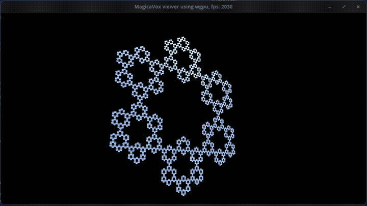
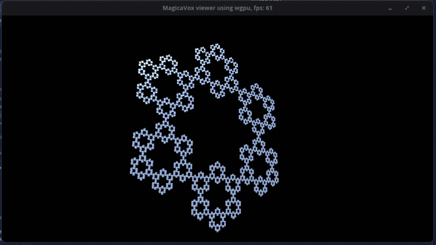

# vox_in_wgpu


*Wayland: high-FPS rendering*


*X11 (`WAYLAND_DISPLAY=""`) — drag-and-drop file loading*

MagicaVoxel `.vox` file viewer built with [wgpu](https://wgpu.rs/).

Opens `assets/snow.vox` by default. Pass a path as a CLI argument or drag and drop a `.vox` file onto the window.

## Dependencies

| Crate | Role |
|---|---|
| [wgpu](https://crates.io/crates/wgpu) | Cross-platform GPU API (Vulkan / Metal / DX12 / WebGL) |
| [winit](https://crates.io/crates/winit) | Window creation and input handling |
| [dot_vox](https://crates.io/crates/dot_vox) | MagicaVoxel file parsing |
| [glam](https://crates.io/crates/glam) | 3D math (vectors, matrices, quaternions) |
| [bytemuck](https://crates.io/crates/bytemuck) | Safe `&[u8]` casting for GPU buffer uploads |

## Running

```sh
cargo run                          # opens assets/snow.vox
cargo run -- path/to/model.vox    # opens a specific file
RUST_LOG=info cargo run           # with loader statistics
```

## Controls

| Input | Action |
|---|---|
| Left drag | Orbit around model |
| Right drag | Pan |
| Scroll wheel | Zoom |
| W / S | Orbit up / down |
| A / D | Orbit left / right |
| Arrow keys | Pan |
| Left Shift / Left Ctrl | Zoom in / out |
| Drop `.vox` on window | Load file, reset camera |

## Architecture

```
src/
├── main.rs          entry point
├── lib.rs           winit event loop (ApplicationHandler), wgpu State, init helpers
├── camera.rs        OrbitCamera, Projection, OrbitController
├── depth.rs         depth texture helper
├── light.rs         LightUniform
├── model/
│   ├── mod.rs       Vertex, Mesh, LightVertex, light cube geometry
│   └── vox.rs       .vox loader, hidden-face culling, LoadError
├── shader.wgsl      Blinn-Phong lighting, color baked per-vertex
└── light.wgsl       flat-shaded light cube
```

## Performance notes

- Hidden-face culling reduces vertex count by ~70–90% on typical dense models (exact numbers logged at startup with `RUST_LOG=info`).
- Color is stored as `Unorm8x4` (4 bytes per vertex) rather than `Float32x4` (16 bytes), reducing vertex buffer size 4×.
- File parsing runs on a background thread, so the render loop never blocks — GPU initialisation and `.vox` parsing overlap at startup.
- The light cube rotates via a quaternion applied to its position each frame; no per-frame buffer reallocation.

## Technical decisions

**Hidden-face culling** — the loader builds a `HashSet` of all occupied voxel positions and emits geometry only for faces with no neighbour. Compared to per-instance full-cube rendering this reduces vertex count significantly for dense models (logged at load time with `RUST_LOG=info`).

**Flat mesh instead of instancing** — voxel color is baked into each vertex (`Unorm8x4`), so the render pipeline needs no instance buffer and no per-instance shader logic. The trade-off is higher upload cost on scene reload, which is acceptable because reloads are infrequent.

**Background loading** — `.vox` parsing runs on a dedicated thread (`std::thread::spawn` + `mpsc::channel`). The initial file is loaded concurrently with GPU initialisation. The render loop polls `try_recv` each frame; a new drop is ignored while a previous load is still in progress.

**Error handling** — IO and parse failures are represented as `LoadError::Io` / `LoadError::Parse` / `LoadError::Empty`. The loader separates `std::fs::read` from `dot_vox::load_bytes` so the error variant is determined structurally, not by inspecting the error message.

## Web / GitHub Pages

A WebAssembly build is deployed automatically on each push to `main`:
**https://bugsweeper.github.io/view_vox_using_wgpu/**

The web version opens the bundled `snow.vox` on startup. You can drop any `.vox` file onto the canvas to load it. Note: parsing and mesh generation run synchronously on the main thread inside the `FileReader` callback, so large files will freeze the UI briefly.

To build locally:
```sh
cargo install trunk
trunk serve          # dev server at http://localhost:8080
trunk build --release  # production build → dist/
```

## Known limitations

**Drag-and-drop on Wayland** — winit does not implement the `wl_data_device` protocol, so `DroppedFile` events are never delivered in a native Wayland session. Workaround — force the X11 backend:

```sh
WAYLAND_DISPLAY="" cargo run
```

Note: if your file manager is a native Wayland application it may refuse to drop onto an XWayland window. Use the CLI argument in that case:

```sh
WAYLAND_DISPLAY="" cargo run -- path/to/model.vox
```

**Multi-model `.vox` files** — voxels from all models are merged into a single `HashSet` for neighbour lookup, so face culling works correctly across model boundaries. However, model transforms defined in the scene graph are ignored; all models are rendered at their raw voxel coordinates.
